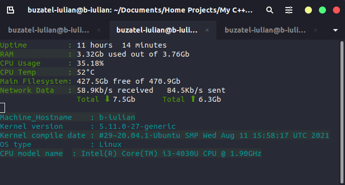

```
 ██████╗██████╗ ██████╗ ███╗   ███╗ ██████╗ ███╗   ██╗
██╔════╝██╔══██╗██╔══██╗████╗ ████║██╔═══██╗████╗  ██║
██║     ██████╔╝██████╔╝██╔████╔██║██║   ██║██╔██╗ ██║
██║     ██╔═══╝ ██╔═══╝ ██║╚██╔╝██║██║   ██║██║╚██╗██║
╚██████╗██║     ██║     ██║ ╚═╝ ██║╚██████╔╝██║ ╚████║
 ╚═════╝╚═╝     ╚═╝     ╚═╝     ╚═╝ ╚═════╝ ╚═╝  ╚═══╝
```

CPPMON is a rudimentary system monitor for Unix systems written in C++, with the intent that its components can be reused in other projects.



#### Reference repositories

* [Main inspiration for the project](https://gist.github.com/caiorss/2527d1402ea1469f67fba9ab172f05e5)
* ANSI Escape Code guide and examples:
  *  [Guide](https://gist.github.com/fnky/458719343aabd01cfb17a3a4f7296797)
  *  [Examples](https://gist.github.com/RabaDabaDoba/145049536f815903c79944599c6f952a)
